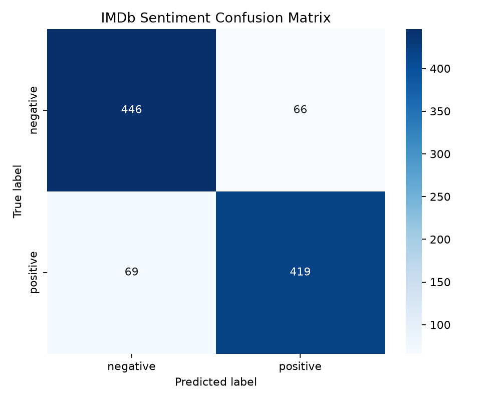

# IMDb Sentiment Classification with DistilBERT


Fine-tune a pretrained transformer for binary movie-review sentiment classification. The project uses Hugging Face `transformers`, `datasets`, and `evaluate` with PyTorch and the `Trainer` API to train, evaluate, save, and run inference with a DistilBERT classifier.

## Dataset

This project uses the [`imdb`](https://huggingface.co/datasets/imdb) dataset from Hugging Face Datasets:

- 25,000 labeled training reviews
- 25,000 labeled test reviews
- Binary labels: `negative` and `positive`

The training script creates a validation split from the original training set and defaults to a practical subset for faster local experimentation.

## Model

The default model is [`distilbert-base-uncased`](https://huggingface.co/distilbert-base-uncased), loaded with `AutoModelForSequenceClassification`.

DistilBERT is a smaller, faster distilled version of BERT. A classification head is added on top of the pretrained encoder and fine-tuned end to end for IMDb sentiment classification.

## Project Structure

```text
.
|-- train.py
|-- evaluate.py
|-- inference.py
|-- requirements.txt
|-- README.md
`-- results/
    |-- metrics.json
    `-- confusion_matrix.png
```

Generated artifacts:

- `models/imdb-distilbert/` stores the fine-tuned model and tokenizer.
- `checkpoints/` stores intermediate Trainer checkpoints.
- `results/metrics.json` stores baseline and fine-tuned metrics from training.
- `results/confusion_matrix.png` stores the test-set confusion matrix.

## Setup

```bash
python -m venv .venv
source .venv/bin/activate  # Windows: .venv\Scripts\activate
pip install -r requirements.txt
```

If PowerShell blocks activation on Windows, run the virtual environment's
Python directly:

```powershell
.\.venv\Scripts\python.exe train.py --help
```

## Train

Run a laptop-friendly experiment:

```bash
python train.py \
  --train-samples 12000 \
  --eval-samples 3000 \
  --test-samples 5000 \
  --epochs 2 \
  --batch-size 16
```

Use the full IMDb dataset by passing `-1` for sample counts:

```bash
python train.py --train-samples -1 --eval-samples -1 --test-samples -1 --epochs 3
```

Reproduce the committed results:

```bash
python train.py \
  --train-samples 2000 \
  --eval-samples 500 \
  --test-samples 1000 \
  --epochs 1 \
  --batch-size 8
```

The training script:

1. Loads IMDb from Hugging Face Datasets.
2. Tokenizes reviews with truncation and dynamic padding.
3. Evaluates a baseline pretrained encoder with an untrained sequence-classification head.
4. Fine-tunes DistilBERT with the Hugging Face `Trainer`.
5. Saves the model locally.
6. Writes metrics and a confusion matrix to `results/`.

## Evaluate

Evaluate a saved model:

```bash
python evaluate.py --model-dir models/imdb-distilbert --test-samples 5000
```

## Inference

Classify a raw movie review:

```bash
python inference.py \
  --model-dir models/imdb-distilbert \
  --text "The performances were excellent and the story stayed with me."
```

Example output:

```json
{
  "confidence": 0.98,
  "label": "positive",
  "probabilities": {
    "negative": 0.02,
    "positive": 0.98
  },
  "text": "The performances were excellent and the story stayed with me."
}
```

## Results

The committed results were generated with `distilbert-base-uncased` using
2,000 training samples, 500 validation samples, 1,000 test samples, 1 epoch,
and a batch size of 8. The raw metrics are saved in `results/metrics.json`.

| Model | Accuracy | Precision | Recall | F1 |
| --- | ---: | ---: | ---: | ---: |
| Pretrained DistilBERT + untrained classifier head | 0.408 | 0.410 | 0.484 | 0.444 |
| Fine-tuned DistilBERT | 0.865 | 0.864 | 0.859 | 0.861 |

The baseline uses the same pretrained DistilBERT encoder before task fine-tuning. Because the sequence-classification head has not learned IMDb labels yet, it should perform near chance; fine-tuning should provide the major gain.

## Confusion Matrix



## Tech Stack

- Python
- PyTorch
- Hugging Face Transformers
- Hugging Face Datasets
- Hugging Face Evaluate
- scikit-learn
- Matplotlib and Seaborn
